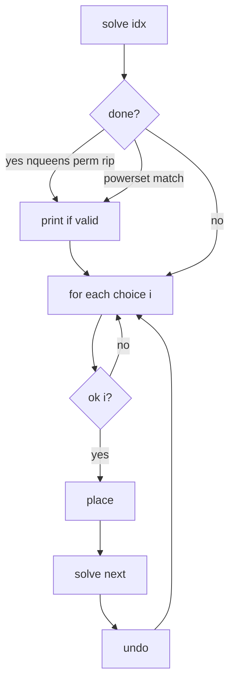

# Level 2 backtracking layout

All four programs in this folder use the same `solve` rhythm. Only the meaning of `idx`, the choice `i`, and **when you print** change.

## Skeleton

```
solve(idx):
    if (done):
        print if valid
        return              // powerset: do NOT return — keep looping

    i = first_allowed
    while (more choices):
        if (ok):
            place
            solve(next)
            undo            // or next loop overwrites
        i++
```

In code, look for the same four lines:

1. **place** — write this choice into the board / set / string  
2. **recurse** — `solve(next)`  
3. **undo** — restore (or overwrite on the next `i`)  
4. **print_sol** — dump the current solution  

`ok` is whichever of these fits:

- a function (`ok(col, row)` in n-queens)
- a flag (`!used[i]` in perm)
- always true (powerset: every remaining number; rip: every later index)



## Mapping

| File | `idx` | choice `i` | place | done |
|------|-------|------------|-------|------|
| `nqueens.c` | column (`col`) | row `0 .. n-1` | `board[col] = row` | `col == n` |
| `perm.c` | slot in result | unused char index | `result[idx] = str[i]` | `idx == len` |
| `powerset.c` | subset length | remaining number | `set[idx] = nums[i]` | sum == target (then still grow) |
| `rip.c` | first index you may blank | position to turn into space | `str[i] = ' '` | `to_remove == 0`, then `is_balanced` |

## When to print (the only real split)

- **Print at leaves:** n-queens, perm — `if (col == n)` / `if (idx == len)` then `print_sol(); return;`
- **Print on the way:** powerset — if current subset sums to target, print, **then keep looping** (a short subset can be a full answer)
- **Budget then check:** rip — stop placing blanks when `to_remove == 0`, then print only if `is_balanced`

## Globals vs extra args

The “board” and sizes are global. Recursion only passes what changes. Arrays live on the **stack in `main`** (VLAs); globals just point at them — **no malloc**.

| File | Globals | `solve` |
|------|---------|---------|
| `nqueens.c` | `n`, `board` | `solve(int col)` |
| `perm.c` | `str`, `result`, `used`, `len` | `solve(int idx)` |
| `powerset.c` | `set`, `target`, `av` | `solve(int idx, int start)` |
| `rip.c` | `str`, `len` | `solve(int idx, int to_remove)` |

Setup stays in `main` (parse, alloc, sort / `min_remove`), then `solve(0)` (powerset/rip pass the extra arg). Rip keeps `min_remove` and `is_balanced` as helpers. Perm sorts the string before `solve`.
